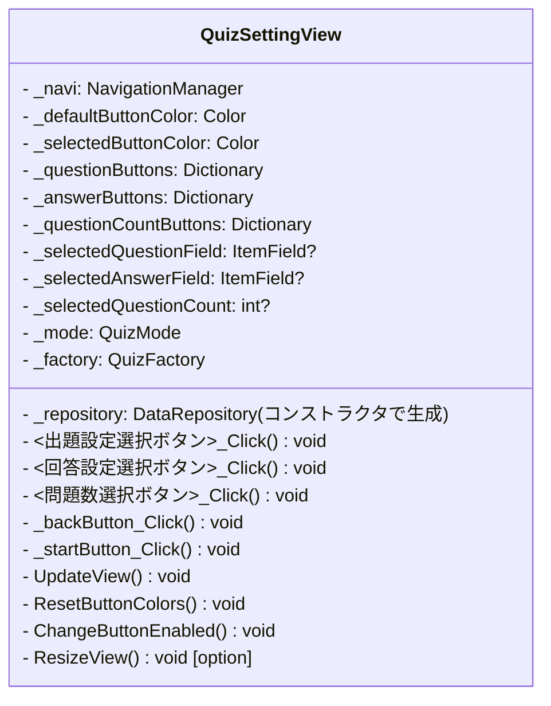

# QuizSetting
## QuizSetting.cs
### クラス図
```mermaid
classDiagram
  direction TB
  class QuizSetting {
    + Mode : QuizMode { get; }
    + QuestionField :ItemField { get; }
    + AnswerField :ItemField { get; }
    + QuestionCount :int { get; }
  }
```

## QuizSettingView.cs
### クラス図


### 各メソッドについて
#### ボタンクリックイベント
- <出題設定選択ボタン>_Click() void
- <回答設定選択ボタン>_Click() void
- <問題数選択ボタン>_Click() void
- ボタンを押したときの処理。
- `_selectedQuestionField`, `_selectedAnswerField`に`ItemField.xx`を入れる。
-`_selectedQuestionCountField` には数値を入れる。
- `UpdateView()`を呼び出す。

#### _backButton_Click メソッド
- 戻るボタンを押したときの処理。
- `_navi.Back();`のみ。

#### _startButton_Click メソッド
- クイズ開始ボタン。
- `_quizSetting`（`QuizSetting`クラス）に`QuestionField`, `AnswerField`, `QuestionCount`を渡して生成
- `view`を`_factory`に生成させ、`_navi`に画面遷移させる。
-`_factory`では`session`を生成してから`view`が作られて返ってくる。

#### UpdateView メソッド
- ボタンが押されるとイベントから呼び出される
- ボタンの色更新
    - 全ボタンを一旦通常色へ戻す
    - 選択中だけ色を変更する
- ボタンの使用不可制御
- スタートボタン活性制御

#### ResetButtonColors メソッド
- 全ボタンの色をデフォルトに戻す

#### UpdateButtonColors メソッド
- ボタンの色をアップデート

#### UpdateButtonEnabled メソッド
- ボタンのEnabledを制御する

#### UpdateStartButton メソッド
- `_startButton`のEnabledを制御する

#### ResizeView メソッド [option]
- Resize イベントに設定する
- 時間があったらのオプション

### UpdateViewについて
#### ボタンの色更新
```csharp
// ボタンの色をリセット
private void ResetButtonColors()
{
    // Dictionary<ItemField, Button> buttons
    foreach (var pair in _questionButtons)
    {
        pair.Value.BackColor = _defaultButtonColor;
    }
    foreach (var pair in _answerButtons)
    {
        pair.Value.BackColor = _defaultButtonColor;
    }
    foreach (var pair in _questionCountButtons)
    {
        pair.Value.BackColor = _defaultButtonColor;
    }
}

// ボタンの使用不可制御
private void UpdateButtonEnabled()
{
    // Dictionary<ItemField, Button> buttons
    foreach (var pair in _questionButtons)
    {
        pair.Value.Enabled =
        pair.Key != _selectedAnswerField;
    }
    foreach (var pair in _answerButtons)
    {
        pair.Value.Enabled =
        pair.Key != _selectedQuestionField;
    }
}

// ボタンの色を変える <- UpdateView
private void UpdateButtonColors()
{
    // ボタンの色を一旦通常色に戻す
    ResetButtonColor();
    
    // 選択されたボタンのみ色を変える
    if (_selectedQuestionField.HasValue)
    {
        _questionButtons[
            _selectedQuestionField.Value]
            .BackColor =
            _selectedButtonColor;
    }
    if (_selectedAnswerField.HasValue)
    {
        _answerButtons[
            _selectedAnswerField.Value]
            .BackColor =
            _selectedButtonColor;
    }
    if (_selectedQuestionCountField.HasValue)
    {
        _questionCountButtons[
            _selectedQuestionCountField.Value]
            .BackColor =
            _selectedButtonColor;
    }
}

private void UpdateStartButton()
{
    _startButton.Enabled =
    _selectedQuestionField.HasValue &&
    _selectedAnswerField.HasValue &&
    _selectedQuestionCount.HasValue;
}

private void UpdateView()
{
    UpdateButtonColors();

    UpdateButtonEnabled();

    UpdateStartButton();
}
```

### スタートボタン
```csharp title="QuizSettingView.cs"
// QuizSettingView.cs
// Nextボタンが押されたイベント処理
var quizItems = _repository.LoadAll();
var setting = new QuizSetting(_mode, _selectedQuestionField, _selectedAnswerField, _selectedQuestionCount);
var view = _factory.CreateQuizView(_navi, setting, quizItems);
_navi.Navigate(view, view.Title);
```


```
HomeView
 ↓
QuizSettingView(mode)

Start
 ↓
QuizSetting生成
 ↓
Repository.LoadAll()
 ↓
Factory.CreateQuizView(
    mode,
    setting,
    items)
 ↓
Session生成
 ↓
View生成
 ↓
Navigate
```